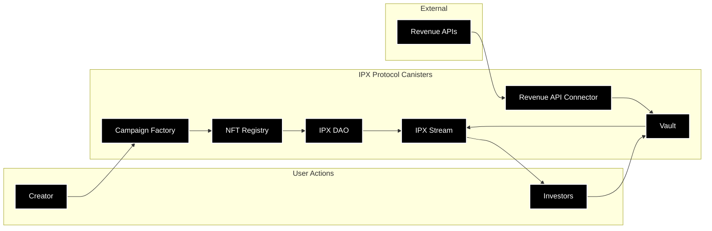
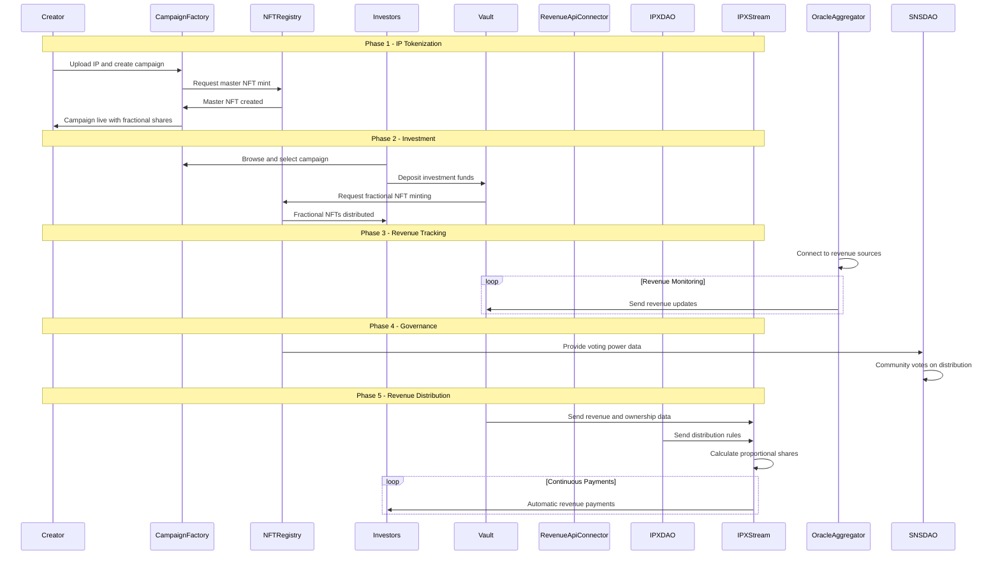

# IPX Protocol

IPX Protocol is a decentralized platform that transforms intellectual property into liquid, tradeable assets. Creators tokenize their IP (music albums, mobile apps, digital content) into fractional NFT shares that investors can purchase. As the IP generates revenue from platforms like Spotify, Steam, or YouTube, the protocol automatically distributes earnings proportionally to all fractional owners through continuous payment streams.

**Example**: A musician sells 1000 fractional shares of their album for $50 each, raising $50K. When the album earns $5K monthly from streaming, each share owner automatically receives $5/month proportional to their ownership percentage.

---

## Canister Interaction Architecture



## Detailed User Journey


---


## Benefits

| For Creators | For Investors |
|--------------|---------------|
| **Instant Capital Access** | Raise funding without debt or giving up full ownership |
| **Retain IP Control** | Keep creative control while sharing revenue |
| **Automated Revenue Sharing** | No manual payment processing to investors |
| **Global Investor Access** | Reach worldwide investor base through blockchain |
| **Transparent Revenue Tracking** | Real-time visibility into earnings and distributions |
| **Community Building** | Engage supporters as stakeholders |

| For Investors | For the Ecosystem |
|---------------|------------------|
| **Passive Income Streams** | Earn proportional revenue without active management |
| **Diversified IP Portfolio** | Invest in multiple IP assets across different sectors |
| **Liquid Ownership** | Trade fractional shares on secondary markets |
| **Transparent Returns** | Real-time tracking of investment performance |
| **Governance Rights** | Vote on protocol decisions and revenue distribution |
| **Early Access** | Get exposure to promising IP before mainstream success |


---

## Creator Flow (WebApp + ICP)

1. **Creator visits WebApp** 
2. **Login with Internet Identity**

   * WebApp calls II → gets Principal ID.
   * Principal is now the creator’s on-chain identity.
3. **Link external accounts**

   * WebApp prompts "Connect YouTube / Spotify / Substack".
   * Creator goes through OAuth → you get `access_token`/`refresh_token`.
   * Backend stores these, keyed by creator’s Principal.
4. **Start Campaign**

   * Creator fills form: title, description, goal, revenue share.
   * WebApp calls `campaign_factory.create_campaign(principal, metadata)` on ICP.
   * A vault canister + oracle config is created.

---

##  Supporter Flow (Fans/Investors)

1. **Fan visits WebApp**.
2. **Login with Internet Identity** 

   * Fan’s Principal = their wallet identity.
3. **Browse Campaigns**

   * WebApp fetches active campaigns from `campaign_factory`.
   * Shows metadata + funding progress.
4. **Fund Campaign**

   * Fan enters ICP/ckBTC amount.
   * Transaction goes into vault canister.
   * NFT minted in `nft_registry` → tied to their Principal.
5. **Track Holdings**

   * Fan can view `/my_nfts` (WebApp calls `nft_registry`).

---

##  Revenue Flow (Oracles + Vaults)

1. Oracle canister fetches YouTube/Spotify/Substack revenue via **http\_request**.
2. Parsed results → stored in `oracle_aggregator` + pushed to Vault.
3. Vault updates **campaign balance**.
4. When revenue distribution is triggered (periodic or manual), Vault pays:

   * Creator (based on share).
   * Fans (based on NFT share).

---

## Payout Flow

* Fans visit WebApp → click **Claim Revenue**.
* WebApp calls `vault.claim(principal)` → payout sent in ICP
* Wallet shows received funds.

---


## Quick Setup

### Prerequisites
- Node.js 18+, npm, dfx, Rust

### Setup
```bash
git clone https://github.com/Ansuman30/IPX.git
```
```bash
cd IPX
```
```bash
./setup.sh
```
```bash
cd frontend && npm run dev
```

Open http://localhost:3000

## Testing the Platform

1. Visit http://localhost:3000
2. Connect Wallet with Internet Identity
3. Create Campaign - connect YouTube and fill details
4. Explore Campaigns and fund them
5. View Portfolio in "My NFTs"


