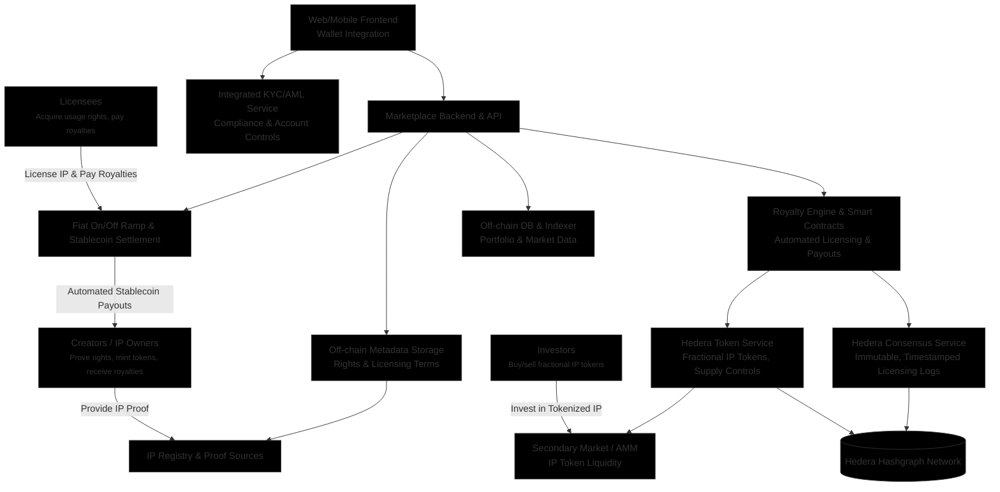

# IPX – Proof-Backed IP Tokenization & Automated Royalty Platform

IPX is a Hedera-powered solution for turning intellectual property — music, art, code, patents, and more — into fractionalized, tradable digital tokens. Each token is backed by verified proof of ownership, with metadata linking to rights and licensing terms. Using Hedera Token Service, creators can mint IP tokens, license them globally, and receive stablecoin royalties instantly via smart contracts.

 All transactions and licensing events are immutably logged through Hedera Consensus Service for full transparency. IPX enables creators to unlock new funding, investors to access a revenue-yielding asset class, and licensees to acquire usage rights seamlessly. This is the future of global, compliant, and automated IP monetization.

---

# Architecture Diagram

```mermaid
flowchart TD
    %% User Layer
    A[Creators / IP Owners<br><small>Prove rights, mint tokens, receive royalties</small>] -->|Provide IP Proof| O
    B[Investors<br><small>Buy/sell fractional IP tokens</small>] -->|Invest in Tokenized IP| Q
    C[Licensees<br><small>Acquire usage rights, pay royalties</small>] -->|License IP & Pay Royalties| P

    %% Frontend & Wallet
    F[Web/Mobile Frontend<br>Wallet Integration] --> G[Integrated KYC/AML Service<br>Compliance & Account Controls]
    F --> H[Marketplace Backend & API]

    %% Backend Services
    H --> I[Royalty Engine & Smart Contracts<br>Automated Licensing & Payouts]
    H --> J[Off-chain Metadata Storage<br>Rights & Licensing Terms]
    H --> K[Off-chain DB & Indexer<br>Portfolio & Market Data]

    %% Hedera Network (DLT)
    I --> L[Hedera Token Service<br>Fractional IP Tokens, Supply Controls]
    I --> M[Hedera Consensus Service<br>Immutable, Timestamped Licensing Logs]
    L --> N[(Hedera Hashgraph Network)]
    M --> N

    %% External Systems
    J --> O[IP Registry & Proof Sources]
    H --> P[Fiat On/Off Ramp & Stablecoin Settlement]
    L --> Q[Secondary Market / AMM<br>IP Token Liquidity]

    %% Flows
    P -->|Automated Stablecoin Payouts| A

    %% Styling
    classDef user fill:#000000,stroke:#333,stroke-width:1px;
    classDef backend fill:#000000,stroke:#333,stroke-width:1px;
    classDef hedera fill:#000000,stroke:#333,stroke-width:1px;
    classDef external fill:#000000,stroke:#333,stroke-width:1px;

    class A,B,C user;
    class F,G,H,I,J,K backend;
    class L,M,N hedera;
    class O,P,Q external;
```

---

# Key Features & Hedera Integration

**Core Capabilities**

* **Proof-Backed Tokenization** – Creators can mint fractionalized IP tokens via Hedera Token Service (HTS), each linked to verified proof of ownership from trusted registries.
* **Automated Licensing & Royalty Payouts** – Smart contracts execute licenses instantly and distribute stablecoin royalties directly to creator wallets without intermediaries.
* **Immutable Licensing Records** – All transactions, licensing events, and proof verifications are recorded via Hedera Consensus Service (HCS) for permanent, tamper-proof audit trails.
* **Secondary Market Liquidity** – IP tokens can be listed and traded on integrated Hedera-compatible secondary markets or AMMs for price discovery and liquidity.
* **Cross-Border Payments** – Hedera-based stablecoin payments (e.g., USDC) enable instant, low-fee global royalty settlements in any currency equivalent.
* **Compliance-Ready Onboarding** – Integrated KYC/AML services ensure token sales and licensing are compliant with jurisdictional requirements.

**Hedera Services Used**

* **Hedera Token Service (HTS)** – Creation, supply control, and transfer of IP tokens.
* **Hedera Consensus Service (HCS)** – Immutable, timestamped records of IP transactions.
* **Mirror Node APIs** – Real-time event tracking for marketplace data and royalty distribution automation.

---

# Problem Statement & Why Web3

**The Problem**
Intellectual property licensing today is slow, opaque, and fragmented. Creators often wait months to receive royalties, while licensing contracts are buried in siloed databases and inaccessible to investors. Tracking ownership and rights transfers is error-prone and expensive, especially across borders. Traditional systems offer little liquidity — once you license your IP, there’s no easy way for others to invest in or trade a share of that asset.

**Why Web3 (and Hedera) is the Solution**
Web3 enables programmable ownership and direct value transfer without intermediaries. With Hedera’s low-cost, high-speed consensus and token services, we can:

* Tokenize IP into fractional, tradable assets with built-in licensing rights.
* Provide immutable public logs of every transaction and licensing event.
* Distribute royalties instantly via stablecoins, eliminating payment delays.
* Open new investment channels by creating a liquid marketplace for IP rights.

Hedera specifically offers **enterprise-grade scalability, finality in seconds, and predictable low fees**, making it ideal for high-frequency micro-royalty payouts and global IP transactions — something legacy Web2 systems cannot achieve at scale.

---

